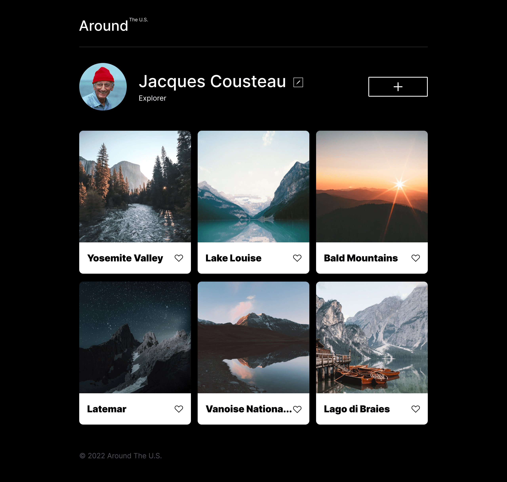
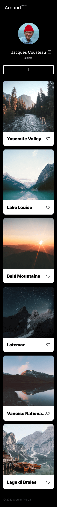

# Project 3: Around The U.S.

Github Project Link:
https://bahrahusam.github.io/se_project_aroundtheus/

Github Repository Link:
https://github.com/bahrahusam/se_project_aroundtheus.git

### Overview

- Intro
- Figma
- Images

Video overview of project:
https://drive.google.com/file/d/1op88iy7Ttt38aBggu-9HkmJJJFh7aVVR/view?usp=sharing

**Intro**

This project is the first rendition of an interactive web page where users can add or remove photos. It is a singular page and used technologies such as flex box, grid, media queries, and uses resposive design to display text/images appropriately on mobile (320px), desktop(1280px) and tablet (880px).

**Figma**

Link to the project on Figma: https://www.figma.com/file/ii4xxsJ0ghevUOcssTlHZv/Sprint-3%3A-Around-the-US?node-id=0%3A1

**Images**

